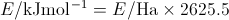

The solution to the BSSE is to use the Counterpoise Correction.  For a dimer five calculations are performed:

* One for the dimer using the full dimer basis
* One calculation for each component with the geometry in the dimer using the component basis
* One calculation for each component using the full dimer basis.

For the latter two calculations only one component is present but the orbitals, as “ghost” orbitals, of the other component are also present.  This leads to a lowering of the component energies as more basis functions are used for each calculation.  An estimate of the interaction energy can be calculated from these values as shown in Equation 2.

**Equation 2:** Interaction energy calculation where the final two terms include the “ghost” orbitals of the other component

Encounter has been built to calculate this interaction energy from the output of a Counterpoise Correction calculation created using the GAUSSIAN modeling package.  Using regular expressions the five energy values are extracted as text and then converted into numeric form.  These values are then used to calculate the interaction energy in both Hartree atomic units and kJmol-1 and the binding constant.  These calculations are outlined in Equations 3 and 4.

**Equation 3:** Conversion of energy from Hartree atomic units to kJmol-1

**Equation 4:** Calculation of the binding constant